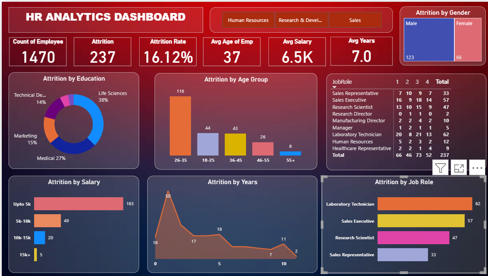

# HR Analytics Dashboard - Power BI

## Project Overview

The HR Analytics Dashboard is an interactive Power BI project designed to analyze employee attrition and workforce trends within an organization. The dashboard provides key insights into employee demographics, salary distribution, education background, job roles, and attrition patterns to support data-driven HR decision-making.

The objective of this project is to identify factors contributing to employee turnover and help organizations improve employee retention strategies.

---

## Dashboard Preview

### HR Analytics Dashboard

---

## Key Performance Indicators (KPIs)

| Metric                   | Value    |
| ------------------------ | -------- |
| Total Employees          | 1470     |
| Attrition Count          | 237      |
| Attrition Rate           | 16.12%   |
| Average Employee Age     | 37 Years |
| Average Salary           | 6.5K     |
| Average Years at Company | 7 Years  |

---

## Dashboard Insights

### 1. Attrition by Education

The dashboard analyzes employee attrition across different educational backgrounds such as:

* Life Sciences
* Medical
* Marketing
* Technical Degree
* Other Educational Fields

This helps identify which education groups experience higher turnover.

### 2. Attrition by Age Group

Employee attrition is segmented into age groups:

* 18–25
* 26–35
* 36–45
* 46–55
* 55+

The analysis shows that employees aged 26–35 contribute the highest attrition.

### 3. Attrition by Salary

Employees are categorized based on salary ranges:

* Up to 5K
* 5K–10K
* 10K–15K
* 15K+

This visualization helps understand the relationship between compensation and employee turnover.

### 4. Attrition by Years at Company

This analysis highlights attrition trends based on employee tenure, helping HR teams identify critical retention periods.

### 5. Attrition by Gender

The dashboard compares attrition between:

* Male Employees
* Female Employees

This provides insights into workforce diversity and turnover distribution.

### 6. Attrition by Job Role

Employee turnover is analyzed across job roles including:

* Laboratory Technician
* Sales Executive
* Research Scientist
* Sales Representative
* Human Resources
* Manager
* Healthcare Representative

This helps identify roles with higher attrition rates.

---

## Business Insights

* Employees aged 26–35 show the highest attrition rate.
* Employees earning less than 5K contribute significantly to overall attrition.
* Laboratory Technicians and Sales Executives experience higher employee turnover.
* Life Sciences and Medical education backgrounds account for a major share of attrition.
* Attrition trends indicate opportunities to improve employee retention strategies.

---

## Tools and Technologies Used

* Power BI Desktop
* DAX (Data Analysis Expressions)
* Data Modeling
* Data Cleaning
* Data Visualization
* Microsoft Excel / CSV Dataset

---

## Project Structure

HR-Analytics-Dashboard-PowerBI/

├── Dashboard/

│ └── HR_Analytics_Dashboard.pbix

├── Dataset/

│ └── HR_Employee_Data.csv

├── Images/

│ └── HR_Dashboard_Overview.png

└── README.md

---

## Skills Demonstrated

* Data Cleaning and Transformation
* Data Modeling
* DAX Calculations
* Interactive Dashboard Design
* Business Intelligence Reporting
* HR Analytics
* Data Visualization

---

## Author

**Bhagat Singh Lodha**

* Data Analyst
* Power BI Developer
* Microsoft Excel Enthusiast

---

## Connect

If you found this project useful, feel free to star the repository and connect with me on LinkedIn.

Thank you for visiting this project.

